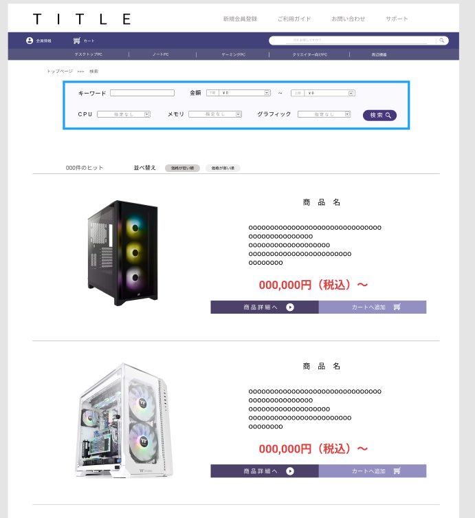

### 画面詳細図
## トップページ
### プロトタイプは以下のリンク先
[プロトタイプ](https://www.figma.com/file/wcRIGueq4vM1sdFyJs55Xj/%E7%94%BB%E9%9D%A2%E3%83%87%E3%82%B6%E3%82%A4%E3%83%B3?node-id=0%3A1)

******

補足：対応DBの列はDB設計後、〇を対応するテーブル・カラムに差し替えること。

### [ヘッダーの画面詳細はこちら](https://github.com/Aso2001011/SD2A03Dev/blob/main/%E7%94%BB%E9%9D%A2%E8%A9%B3%E7%B4%B0%E5%9B%B3/%E3%83%98%E3%83%83%E3%83%80%E3%83%BC.md)
### [フッターの画面詳細はこちら](https://github.com/Aso2001011/SD2A03Dev/blob/main/%E7%94%BB%E9%9D%A2%E8%A9%B3%E7%B4%B0%E5%9B%B3/%E3%83%95%E3%83%83%E3%82%BF%E3%83%BC.md)

| ID | 要素 | 内容 | アクション | イベント |　対応DB |
|----|------|------|------------|---------|--------------|
|1|パンくずリスト|テキスト・リンク|クリック|ページ遷移を表示|-|
|2|絞り込み検索|テキストボックス・セレクトボックス|入力|大まかな条件をもとに検索結果を表示する|〇|
|3|検索|ボタン|クリック|セレクトボックスの内容をもとに検索結果ページへ移動|-|
|4|検索ヒット数|テキスト|-|検索ヒットした商品数を表示する|o|
|5|並び替え|ラジオボタン|クリック|表示条件をもとに並び替えする|o|
|6|商品画像|画像|クリック|商品画像を表示する|o|
|7|商品詳細へ|ボタン|クリック|商品詳細ページへ移動する|-|
|8|カートへ追加|ボタン|クリック|商品をカートに追加する|o|

