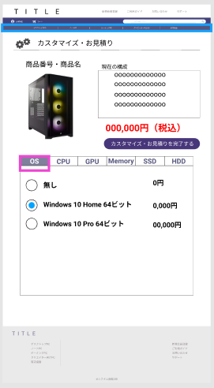

### 画面詳細図
## カスタマイズページ
### プロトタイプは以下のリンク先
[プロトタイプ](https://www.figma.com/file/wcRIGueq4vM1sdFyJs55Xj/%E7%94%BB%E9%9D%A2%E3%83%87%E3%82%B6%E3%82%A4%E3%83%B3?node-id=0%3A1)

******

補足：対応DBの列はDB設計後、〇を対応するテーブル・カラムに差し替えること。

### [ヘッダーの画面詳細はこちら](https://github.com/Aso2001011/SD2A03Dev/blob/main/%E7%94%BB%E9%9D%A2%E8%A9%B3%E7%B4%B0%E5%9B%B3/%E3%83%98%E3%83%83%E3%83%80%E3%83%BC.md)
### [フッターの画面詳細はこちら](https://github.com/Aso2001011/SD2A03Dev/blob/main/%E7%94%BB%E9%9D%A2%E8%A9%B3%E7%B4%B0%E5%9B%B3/%E3%83%95%E3%83%83%E3%82%BF%E3%83%BC.md)

| ID | 要素 | 内容 | アクション | イベント |　対応DB |
|----|------|------|------------|---------|--------------|
|1|カスタマイズ・お見積り|テキスト|-|テキスト表示|-|
|2|商品番号・商品名|テキスト|-|検索結果や商品一覧から飛んできた商品の名前を表示する|o|
|3|商品画像|画像|-|商品画像を表示する|o|
|4|現在の構成|テキスト|-|テキスト表示|-|
|5|構成詳細|テキスト|-|現在の構成を表示する|o|
|5|値段|テキスト|-|商品の値段を表示する|o|
|6|カスタマイズ・お見積りを完了する|ボタン|クリック|購入ページに移動する||
|7|カスタマイズ画面|タブ・ラジオボタン|クリック|好みの構成にカスタマイズする|o|

