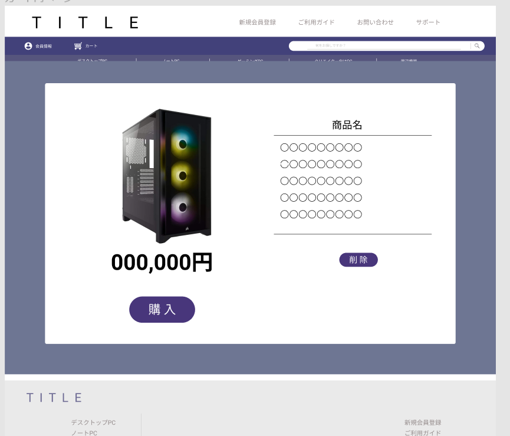

### 画面詳細図
## カート内ページ
### プロトタイプは以下のリンク先
[プロトタイプ](https://www.figma.com/file/wcRIGueq4vM1sdFyJs55Xj/%E7%94%BB%E9%9D%A2%E3%83%87%E3%82%B6%E3%82%A4%E3%83%B3?node-id=0%3A1)

******

補足：対応DBの列はDB設計後、〇を対応するテーブル・カラムに差し替えること。

### [ヘッダーの画面詳細はこちら](https://github.com/Aso2001011/SD2A03Dev/blob/main/%E7%94%BB%E9%9D%A2%E8%A9%B3%E7%B4%B0%E5%9B%B3/%E3%83%98%E3%83%83%E3%83%80%E3%83%BC.md)
### [フッターの画面詳細はこちら](https://github.com/Aso2001011/SD2A03Dev/blob/main/%E7%94%BB%E9%9D%A2%E8%A9%B3%E7%B4%B0%E5%9B%B3/%E3%83%95%E3%83%83%E3%82%BF%E3%83%BC.md)

| ID | 要素 | 内容 | アクション | イベント |　対応DB |
|----|------|------|------------|---------|--------------|
|1|商品画像|画像|-|画像表示|-|
|2|商品名|テキスト|-|商品名を表示する|o|
|3|構成|テキスト|-|商品の構成を表示|o|
|4|値段|テキスト|-|商品の値段を表示|o|
|5|削除|ボタン|クリック|カートから削除する|-|
|6|購入|ボタン|クリック|購入ページに移動|-|

