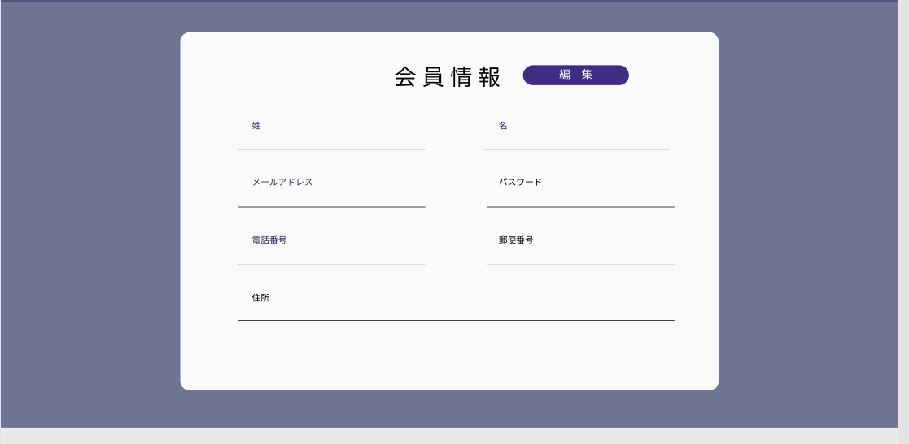

### 画面詳細図
## 会員情報ページ
### プロトタイプは以下のリンク先
[プロトタイプ](https://www.figma.com/file/wcRIGueq4vM1sdFyJs55Xj/%E7%94%BB%E9%9D%A2%E3%83%87%E3%82%B6%E3%82%A4%E3%83%B3?node-id=0%3A1)

******

補足：対応DBの列はDB設計後、〇を対応するテーブル・カラムに差し替えること。

### [ヘッダーの画面詳細はこちら](https://github.com/Aso2001011/SD2A03Dev/blob/main/%E7%94%BB%E9%9D%A2%E8%A9%B3%E7%B4%B0%E5%9B%B3/%E3%83%98%E3%83%83%E3%83%80%E3%83%BC.md)
### [フッターの画面詳細はこちら](https://github.com/Aso2001011/SD2A03Dev/blob/main/%E7%94%BB%E9%9D%A2%E8%A9%B3%E7%B4%B0%E5%9B%B3/%E3%83%95%E3%83%83%E3%82%BF%E3%83%BC.md)

| ID | 要素 | 内容 | アクション | イベント |　対応DB |
|----|------|------|------------|---------|--------------|
|1|会員情報|テキスト|-|テキスト表示|-|
|2|編集|ボタン|クリック|会員情報の編集を完了する|o|
|3|姓|テキスト|-|テキスト表示|-|
|4|姓入力|入力欄|入力|姓を入力|-|
|5|名|テキスト|-|テキスト表示|-|
|6|名入力|入力欄|入力|名を入力|-|
|7|メールアドレス|テキスト|-|テキスト表示|-|
|8|メールアドレス入力|入力欄|入力|メールアドレスを入力|-|
|9|パスワード|テキスト|-|テキスト表示|-|
|10|パスワード入力|入力欄|入力|パスワードを入力|-|
|11|電話番号|テキスト|-|テキスト表示|-|
|12|電話番号入力|入力欄|入力|電話番号を入力|-|
|13|郵便番号|テキスト|-|テキスト表示|-|
|14|郵便番号入力|入力欄|入力|郵便番号を入力|-|
|15|住所|テキスト|-|テキスト表示|-|
|16|住所入力|入力欄|入力|住所を入力|-|

